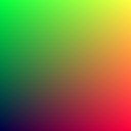

# 01. RGB and PPM

## 실습 목표
> rgb 그라데이션 이미지를 ppm파일로 생성.
>
> 목표 산출물 :
>
> 
>
> ***이미지1: 그라데이션 이미지***

## 01.1 RGB Color
## 01.2 PPM 이미지 파일 포맷

```c
#include <stdio.h>

int	main(void)
{
	int		i;
	int		j;
	double	r;
	double	g;
	double	b;

	//Canvas
	int canvas_width = 256;
	int canvas_height = 256;

	//Render
	//P3 means colors are in ASCII, then columns(width) and
	printf("P3\n%d %d\n255\n", canvas_width, canvas_height); rows(height)
	j = canvas_height - 1;
	while (j >= 0)
	{
		i = 0;
		while (i < canvas_width)
		{
			r = (double)i / (canvas_width - 1);
			g = (double)j / (canvas_height - 1);
			b = 0.25;
			printf("%d %d %d\n", (int)(255.999 * r), (int)(255.999 * g), (int)(255.999 * b));
		++i;
		}
	--j;
	}
	return (0);
}
```
