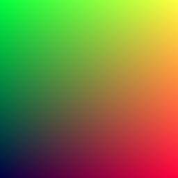

# 2. 벡터

## 실습 목표
> 1. 3차원 벡터 구조체를 만든다.
>
> 2. 3차원 벡터 유틸리티 함수를 만든다.
>
> 우리가 만들 레이 트레이서 프로그램은 3차원 유클리드 좌표계(익히 알고 있는 x, y, z 3축으로 된 좌표계)를 사용할 것입니다.
>
> 이번 단원에서는 우리가 생성하게 될 카메라, 광선, 구체 등의 점, 벡터, 색상 정보를 저장하기 위한 3차원 벡터 구조체를 만들고 벡터 연산을 위한 유틸리티 함수 세트를 만들 것입니다.

## 2.1 벡터3 구조체

```c

#ifndef STRUCTURES_H
# define STRUCTURES_H

typedef struct s_vec3 t_vec3;

struct	s_vec3
{
	double x;
	double y;
	double z;
};
#endif

```

***코드1: [structures.h] t_vec3 구조체 정의


## 2.2 벡터3 유틸리티 함수 세트

```c
#include "structures.h"
#include "stdio.h"

//벡터 생성자
t_vec3	vec3(double x, double y, double z)
{
	t_vec3 vec;

	vec.x = x;
	vec.y = y;
	vec.z = z;
	return (vec);
}

// 벡터 값 설정
void	vset(t_vec3 *vec, double x, double y, double z)
{
	vec->x = x;
	vec->y = y;
	vec->z = z;
}

// 벡터 길이 제곱
double	vlength2(t_vec3 vec)
{
	return (vec.x * vec.x + vec.y * vec.y + vec.z * vec.z);
}

// 벡터 길이
double	vlength(t_vec3 vec)
{
	return (sqrt(vlength2(vec)));
}

// 벡터 정규화
t_vec3	vnormalize(t_vec3 vec)
{
	double	nor2;
	double	inv_nor;

	nor2 = vlength2(vec);
	if (nor2 > 0)
	{
		inv_nor = 1 / sqrt(nor2);
		vec.x *= inv_nor;
		vec.y *= inv_nor;
		vec.z *= inv_nor;
	}
	return (vec);
}

// 벡터합
t_vec3	vplus(t_vec3 vec, t_vec3 vec2)
{
	vec.x += vec2.x;
	vec.y += vec2.y;
	vec.z += vec2.z;
	return (vec);
}

// 벡터합2
t_vec3	vplus_(t_vec3 vec, double x, double y, double z)
{
	vec.x += x;
	vec.y += y;
	vec.z += z;
	return (vec);
}

// 벡터차
t_vec3	vminus(t_vec3 vec, t_vec3 vec2)
{
	vec.x -= vec2.x;
	vec.y -= vec2.y;
	vec.z -= vec2.z;
	return (vec);
}

// 벡터차2
t_vec3	vminus_(t_vec3 vec, double x, double y, double z)
{
	vec.x -= x;
	vec.y -= y;
	vec.z -= z;
	return (vec);
}

// 벡터, 스칼라 곱연산
t_vec3	vmult(t_vec3 vec, double t)
{
	vec.x *= t;
	vec.y *= t;
	vec.z *= t;
	return (vec);
}

// 벡터 축 값끼리 곱연산
t_vec3	vmult_(t_vec3 vec, t_vec3 vec2)
{
	vec.x *= vec2.x;
	vec.y *= vec2.y;
	vec.z *= vec2.z;
	return (vec);
}

// 벡터 스칼라 나누기
t_vec3	vdevide(t_vec3 vec, double t)
{
	vec.x *= 1 / t;
	vec.y *= 1 / t;
	vec.z *= 1 / t;

	return vec;
}

// 벡터 내적
double	vdot(t_vec3 vec, t_vec3 vec2)
{
	return (vec.x * vec2.x + vec.y * vec2.y + vec.z * vec2.z);
}

// 벡터 외적
t_vec3	vcross(t_vec3 vec, t_vec3 vec2)
{
	t_vec3 new;

	new.x = vec.y * vec2.z - vec.z * vec2.y;
	new.y = vec.z * vec2.x - vec.x * vec2.z;
	new.z = vec.x * vec2.y - vec.y * vec2.x;
	return (new);
}

// 벡터 정규화(단위 벡터)
t_vec3	vunit(t_vec3 vec)
{
	double len = vlength(vec);
	if (len == 0)
	{
		perror("Devider is 0");
		exit(1);
	}
	vec.x /= len;
	vec.y /= len;
	vec.z /= len;
	return (vec);
}

```
***코드2: [vec3_utils.c] 벡터3 유틸리티 함수***

## 2.3 벡터3 구조체를 점3, 색상3으로 확장

점3(x,y,z)과 색상3(r,g,b) 는 벡터와 마찬가지로 double 형 변수 3개를 맴버로하기 때문에 벡터3 구조체를 typedef로 확장하여 이들 또한 vec3유틸리티 함수를 이용할 수 있게 정의해둔다.

```c
#ifndef STRUCTURES_H
# define STRUCTURES_H

typedef struct s_vec3 t_vec3;
/** 추가 **/
typedef struct s_vec3 t_point3;
typedef struct s_vec3 t_color3;
/*********/

struct s_vec3
{
	double x;
	double y;
	double z;
};
#endif
...
```

***코드***

생성자 함수도 vec3_util.c에 추가해 줍니다.

```c
#include "structures.h"
#include "stdio.h"

//벡터3 생성자
t_vec3	vec3(double x, double y, double z)
{
	t_vec3 vec;

	vec.x = x;
	vec.y = y;
	vec.z = z;
	return (vec);
}

/** 추가 **/
//포인트3 생성자
t_point3 point3(double x, double y, double z)
{
	t_point3 point;

	point.x = x;
	point.y = y;
	point.z = z;
	return (point);
}

//색상3 생성자
t_point3 color3(double r, double g, double b)
{
	t_color3 color;

	color.x = r;
	color.y = g;
	color.z = b;
	return (color);
}
/*********/
...

```

## 2.4 색상 출력 함수

한 픽셀의 색상을 표준 출력 스트림으로 출력하는 유틸리티 함수를 만들것입니다.
[0,1]로 저장되어있는 rgb 값을 각각 [0,255]로 맵핑하여 출력합니다.

```c
#include "color.h"

// [0,1] 로 되어있는 rgb 값을 각각 [0,255] 로 치환해서 출력.
void	write_color(t_color3 pixel_color)
{
	printf("%d %d %d\n", (int)(255.999 * pixel_color.x),
						(int)(255.999 * pixel_color.y),
						(int)(255.999 * pixel_color.z));
}

```
***코드 :[color.c] write_color 함수***

```c
#ifndef COLOR_H
# define COLOR_H

# include "stdio.h"
# include "structures.h"

void	write_color(t_color3 pixel_color);

#endif

```
***코드 :[color.h]

헤더를 추가하여 main을 수정합니다.


```c
#include <stdio.h>
#include "structures.h"
/** 추가 **/
#include "vec3_utils.h"
#include "color.h"
/*********/

int	main(void)
{
	/** 수정 **/
	int			i;
	int			j;
	t_color3	pixel_color;
	/*********/

	//Canvas
	int canvas_width = 256;
	int canvas_height = 256;

	//Render
	// P3 means colors are in ASCII, then columns(width) and rows(height)
	printf("P3\n%d %d\n255\n", canvas_width, canvas_height);
	j = canvas_height - 1;
	while (j >= 0)
	{
		i = 0;
		/** 수정 **/
		while (i < canvas_width)
		{
			pixel_color.x = (double)i / (canvas_width - 1);
			pixel_color.y = (double)j / (canvas_height - 1);
			pixel_color.z = 0.25;
			write_color(pixel_color);
		/*********/
		++i;
		}
	--j;
	}
	return (0);
}

```

실행 결과:


