# ISSUE
-[x] light가 objects의 첫번째 요소일 때 제대로 동작 안하는 문제.
> 해결 : ray_color 안에 if hit 안에 objs->type == LIGHT 이 부분이 문제. 삭제
---

# Study

장면 구성

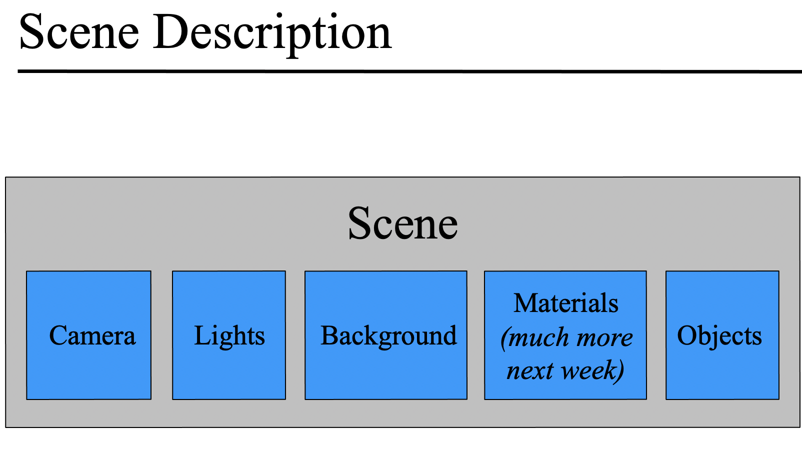

- 카메라
- 조명
- 배경
- 오브젝트
- 메터리얼
- (텍스쳐)

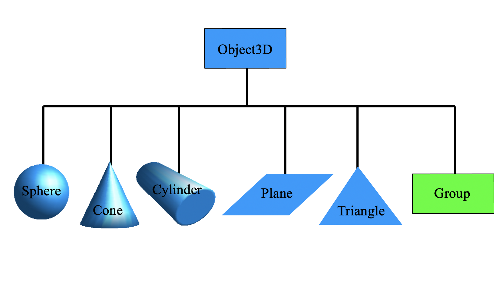

## 광원

[광원 / 퐁모델](https://zamezzz.tistory.com/154)

점광원(조명) -- 거리에 반비례해서 광량이 줄어든다.
무한대 광원(태양)  -- 거리에 비례해서 광량이 줄지 않는다. 1.0
방향 광원 -- 정해진 구체적인 광원의 위치는 없으며 방향만 존재한다.

## 표면 타입 > 퐁모델

난반사도 + 간접광 + 하이라이트도

## 표면 색상

albedo - 반사율
( 표면이 r, g, b 각각을 어떻게 반사하는지 비율);

## 몬테카를로 before after

[링크](https://www.scratchapixel.com/lessons/3d-basic-rendering/global-illumination-path-tracing/global-illumination-path-tracing-practical-implementation)

## 퐁 모델 설계

### light
1. 점광원  > 오브젝트 텍스쳐
2. 주변광(조도) (background)
3. 방향광(태양광) ?()

### 반사
1. 주변광
2. 난반사도 > 오직 난반사만 하면 램버시안 물체
3. 하이라이트

## Direct_specular / Caustics/ Monte_carlo

[이친구 레이트레이서 메인함수 참고하면 좋을듯](https://github.com/kbladin/Monte_Carlo_Ray_Tracer)

## 평면 교점 구하기

[스크래치픽셀](https://www.scratchapixel.com/lessons/3d-basic-rendering/minimal-ray-tracer-rendering-simple-shapes/ray-plane-and-ray-disk-intersection)

## 사각형

Subject에서 제시하는 사각형은, axis aligned 한 사각형으로 받아들이는게 맞는듯
cause (중점과 법선 외에 다른 정보가 없음)

## Transformin

[MIT ppt](http://groups.csail.mit.edu/graphics/classes/6.837/F03/lectures/05_transformation_hierarchy.ppt)

## 실린더 교점 구하기

[강의pdf](https://mrl.cs.nyu.edu/~dzorin/rend05/lecture2.pdf)

## 그림자 이슈! 빛이 뒤에있을 때.

## 각종 quadrics 방정식

[이거](https://mrl.cs.nyu.edu/~dzorin/cg05/lecture12.pdf)

## 변환

행렬 곱에서 교환법칙은 안되지만! 결합, 분배법칙은 가능.

[mit.edu>ppt](http://groups.csail.mit.edu/graphics/classes/6.837/F03/lectures/05_transformation_hierarchy.ppt

[4*4 역행렬 구하기 공식](https://semath.info/src/inverse-cofactor-ex4.html)
[4*4 가우스 소거법으로 역행렬 구하기](https://www.intmath.com/matrices-determinants/inverse-matrix-gauss-jordan-elimination.php)

[법선 벡터 변환 행렬](https://tails.tistory.com/entry/%EC%A3%BC%EC%96%B4%EC%A7%84-%EB%85%B8%EB%A9%80%EB%B2%A1%ED%84%B0%EC%97%90-Model%ED%96%89%EB%A0%AC%EC%9D%98-%EC%A0%84%EC%B9%98%EC%97%AD%ED%96%89%EB%A0%AC%EC%9D%84-%EA%B3%B1%ED%95%98%EB%8A%94-%EC%9D%B4%EC%9C%A0)

[법선 벡터의 변환을 위한 법선 행렬](http://www.gisdeveloper.co.kr/?p=2224)

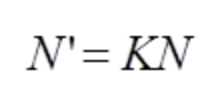

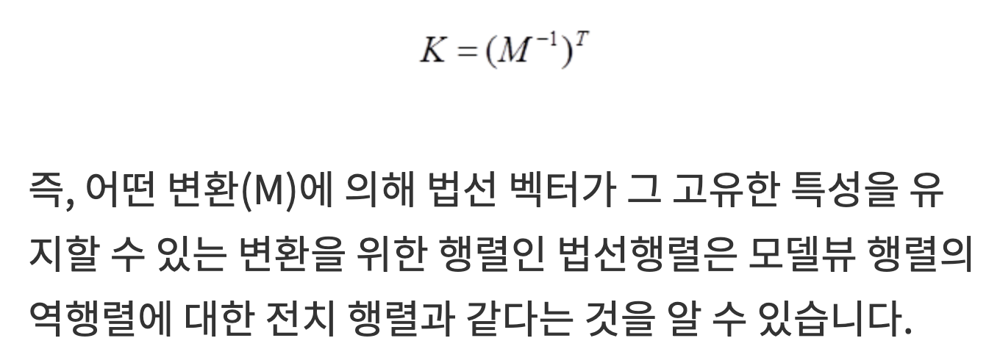

[행렬 변환 한글설명](https://metalkim.tistory.com/331)

[row major 역행렬 ](http://rodolphe-vaillant.fr/?e=7)

[역행렬 구하기 동영상 강의](https://www.youtube.com/watch?app=desktop&v=1VNJfHozgco)

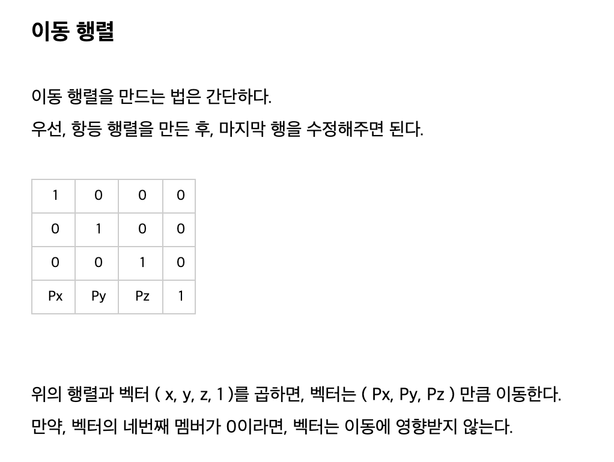

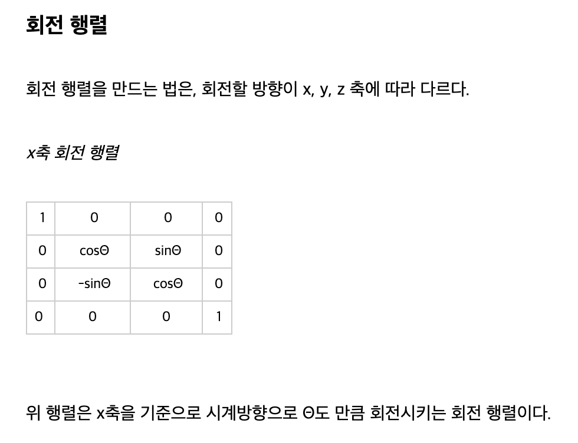

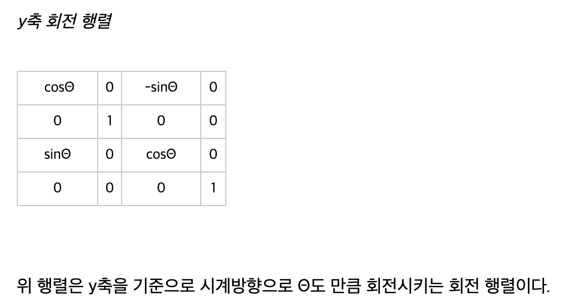

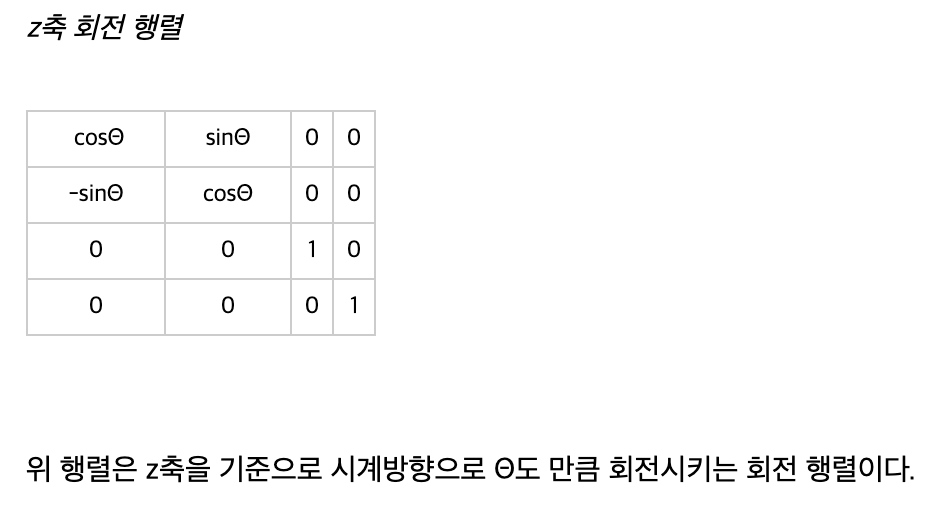

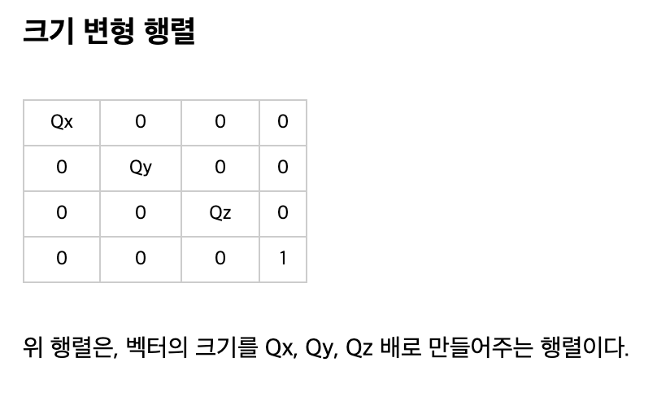

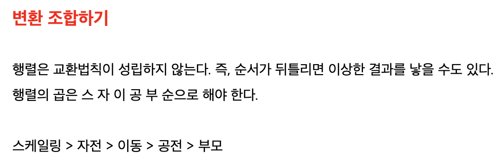

스케일 -> 자전(우리가 다루는 단일 오브젝트 회전) -> 이동;
변환 행렬 : 이동 + 회전 하나의 행렬로 표현 가능.
스케일 : 만 따로  다뤄도 될듯.

회전이 x,y,z 축 회전을 모두 적용이 가능한가?
가능하다면 변환행렬에 곱하는 순서는 어떻게 해야 하는가?

쿼터니언... 이란거를  통해 짐벌락 현상을 막는다고 한다.. ?

[**짐벌락**](https://skmagic.tistory.com/12)
오일러 앵글을 통해 회전 행렬을 이용한 회전을 할 때 발생하는 문제

[짐벌락2](http://blog.daum.net/aero2k/56)

짐벌락 좋은 예시 사진

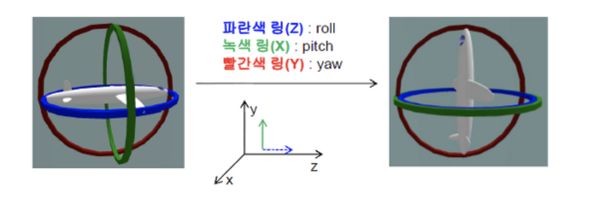

이 해결책 1.[쿼터니언](https://showmiso.tistory.com/57)
2.[오일러 각 회전 순서 바꾸기](https://3dmpengines.tistory.com/802)

## object/ class /instance

[요기 설명 ](https://ko.wikipedia.org/wiki/%EC%9D%B8%EC%8A%A4%ED%84%B4%EC%8A%A4_(%EC%BB%B4%ED%93%A8%ED%84%B0_%EA%B3%BC%ED%95%99))

## [OpenGL basic lighting](http://www.paulsprojects.net/tutorials/simplebump/simplebump.html)

Vertex Color = emission + globalAmbient + sum(attenuation * spotlight *
               [lightAmbient + (max {L.N, 0} * diffuse) + (max {H.N, 0} ^ shininess)*specular])

Where:

emission	is the material's emissive color
globalAmbient	is the ambient color*global ambient brightness
attenuation	is a term causing lights to become dimmer with distance
spotlight	is a term causing spotlight effects
lightAmbient	is the light's ambient color*brightness
diffuse	is the light's diffuse color * the material's diffuse color
shininess	is the specular exponent, which tells us how shiny a surface is
specular	is the light's specular color * the material's specular color
L	is the normalised(unit length) vector from the vertex we are lighting to the light
N	is the unit length normal to our vertex
H	is the normalised "half angle" vector, which points half way between L and the viewer (V)
Here is a diagram describing these vectors:

## 안티 얼라이어싱

[안티얼라이어싱에는 크게 2가지 방법이 있다](https://computergraphics.stackexchange.com/questions/4248/how-is-anti-aliasing-implemented-in-ray-tracing)

1. 레이트레이싱 아닌 최종 이미지를 안티 얼라이싱 하는 방법
   [FXAA](https://namu.wiki/w/%EC%95%88%ED%8B%B0%EC%97%90%EC%9D%BC%EB%A6%AC%EC%96%B4%EC%8B%B1#s-12)
2. Sample을 늘려서 안티얼라이어싱 하는 태크틱 중 이거 괜찮은듯

the second method is to take into account multiple rays for each pixel and then averaging the result. For a very simple version think of it like this:

- you render first an image of size 1024x1024, one ray for each pixel (for example)
- after rendering, you scale the image to 512x512 (each 4 pixels are avereged into one) and you can notice that the edges are smoother. This way you have effectively used 4 rays for each pixel in the final image of 512x512 size.

> 샘플 펄 픽셀을, 1, 4, 16 이런식으로 증가시키는 방법,  그럼 그냥 가로 2배 세로 2배(sample * 4) 한 뒤 4픽셀씩 묶어서 평균을 내면 된다!.
> [안티얼라이어싱 종류 및 설명 좋은 자료](https://www.slideshare.net/JinWooLee2/anti-aliasing)
> 정적인 이미지를  대상으로 하니, 슈퍼 샘플링으로 해볼까?.
> [Super Sampling](https://ko.wikipedia.org/wiki/%EC%8A%88%ED%8D%BC%EC%83%98%ED%94%8C%EB%A7%81)
> [Stochastic Sampling](http://www.cs.cmu.edu/afs/cs/academic/class/15462-s15/www/lec_slides/p51-cook.pdf)

## 레이트레이싱 강의 자료

[호오](https://www.cs.cmu.edu/afs/cs/academic/class/15462-s09/www/lec/13/lec13.pdf)

## 멀티 쓰레딩

- 쓰레드가 뭐지?
[쓰레드란 무엇인가](https://goodgid.github.io/What-is-Thread/)

[파식스 쓰레딩](https://stackoverrun.com/ko/q/4651)

[파식스 쓰레드 레퍼런스](https://www.joinc.co.kr/w/Site/Thread/Beginning/PthreadApiReference)

[POSIX 스레드](https://ko.wikipedia.org/wiki/POSIX_%EC%8A%A4%EB%A0%88%EB%93%9C)

[How to 'multithread' c code](https://stackoverflow.com/questions/3908031/how-to-multithread-c-code)

[바람직한 멀티스레딩 구조](https://www.youtube.com/watch?v=M1e9nmmD3II)

[멀티쓰레드 예제](https://doorbw.tistory.com/27%E3%85%81)

## 비트맵 구조체 만들기

[비트맵 파일 구조](https://dojang.io/mod/page/view.php?id=702)

[구조체 만들기](https://dojang.io/mod/page/view.php?id=703)
